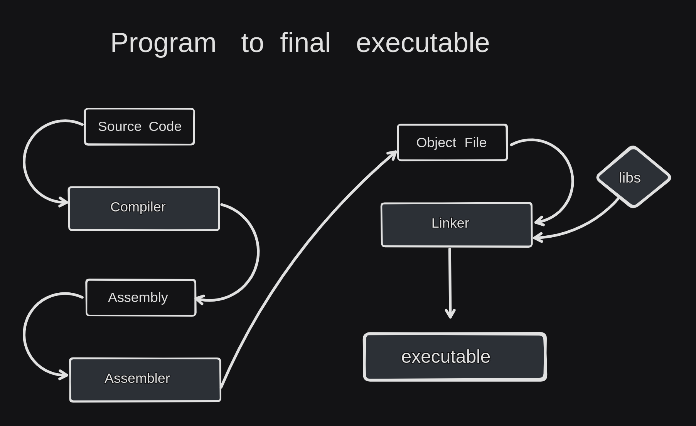

# Building a compiler from scratch

---

## Introduction

I don't know anything about how to make this compiler and all, still trying and following this tutorial (mostly copy-pasting stuffs or you can say coding along) from [Pixeled]() YouTube channel's compiler series. Doing research on the go and trying to figure out stuffs.

## A basic overview of - A program to executable

## What is an assembler ? What is NASM ?

First we are trying to write assembly code which will go through the assembler. And here as assembler we will use NASM.

- **What is an Assembler?**

An assembler is a computer program that translates assembly language code into machine code, allowing for direct communication with a computer's hardware. It converts human-readable instructions into binary code that the central processing unit (CPU) can execute. Assemblers are used for low-level programming and are specific to a particular computer architecture.

- **How does assembler work?**

Assembler translates human-readable assembly instructions into machine code that the computer's processor can understand. It does this by replacing each assembly instruction with the corresponding machine code representation.

- **What are the advantages of using assembler?**

Using assembler allows you to have precise control over the hardware, resulting in highly optimized and efficient code. It is also useful for tasks that require specific hardware interactions or when performance is critical.

- **How does assembler interact with the hardware?**

Assembler interacts with the hardware by utilizing the instructions and addressing modes supported by the processor architecture. It allows direct manipulation of registers, memory, and other hardware resources.

- **Is it possible to mix assembler code with code written in other programming languages?**

Yes, it is possible to mix assembler code with code written in other programming languages. This can be achieved by calling assembly code from a higher-level language or embedding assembly code within the code written in another language.

- **What are some popular assembler languages?**

Some popular assembler languages include x86 assembly (used for Intel® processors), ARM assembly (used for ARM-based processors), microprocessor without interlocked pipeline stages (MIPS) assembly (used in embedded systems), and PowerPC assembly (used in some gaming consoles).

- **What are some popular cross-platform assemblers?**

Some popular cross-platform assemblers include netwide assembler (NASM), yet another service management model (YASM), and turbo assembler (TASM). These assemblers support multiple processor architectures and provide features to aid in writing portable assembly code.

- **What is the difference between netwide assembler (NASM) and yet another service management model (YASM)?**

NASM and YASM are both popular cross-platform assemblers, but they have some differences. NASM is designed to be compatible with Intel x86 processors and has a syntax similar to NASM's predecessor, the "8086" assembly language. YASM is a rewrite of NASM and aims to improve efficiency and extensibility. It supports a wider range of processor architectures and has some additional features not found in NASM.

- **What is the difference between little-endian and big-endian byte order?**

Little-endian and big-endian are two different byte orders used in computer systems. In little-endian, the least significant byte is stored first, while in big-endian, the most significant byte is stored first. For example, in little-endian, the number 0x12345678 would be stored as 0x78 0x56 0x34 0x12, whereas in big-endian, it would be stored as 0x12 0x34 0x56 0x78. The choice of byte order can affect how data is interpreted and manipulated in assembly code.

- **How are interrupts handled in assembly language?**

In assembly language, interrupts are handled by setting up interrupt service routines (ISRs) that are executed when an interrupt occurs. The ISR is a block of code that is responsible for handling a specific interrupt. When an interrupt occurs, the processor will transfer control to the corresponding ISR, allowing the necessary processing to take place. Interrupts are commonly used for tasks such as responding to hardware events, performing system calls, or handling errors.

- **Can assembly language be used for high-level tasks like web development or mobile app development?**

While assembly language can technically be used for such tasks, it is not common or practical due to its low-level nature. High-level languages are generally better suited for these types of tasks.

- **Can assembly language be used for developing real-time systems or embedded systems?**

Yes, assembly language is commonly used in real-time systems and embedded systems due to its ability to provide precise control over hardware resources and meet strict timing requirements.

Source of this QnA: `https://www.lenovo.com/us/en/glossary/assembler/`
